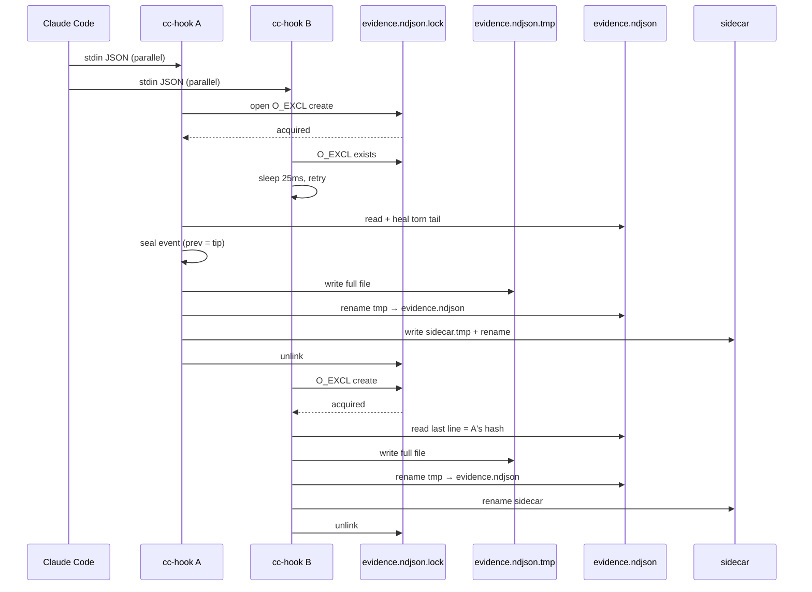

# Claude Code live writer 0.1 (draft for review)

How a **live** Claude Code session appends `evidence.ndjson`. Mapping of hook fields to evidence kinds stays in [0.1-adapter.md](./0.1-adapter.md) §3. This document is the **process contract**: registration, pack lifecycle, locking, stdout/exit, tests.

Verdict remains post-hoc (`session-contract check`). Hooks never write `verdict.md` and never set `outcome: pass`.

Facts below match the Hooks reference ([code.claude.com/docs/en/hooks](https://code.claude.com/docs/en/hooks)) plus a **measured** 2.1.87 binary. `settings.json` `hooks` is `{ "<Event>": [{ "matcher": "...", "hooks": [{ "type": "command", "command": "<shell string>", "timeout"? }] }] }`. Empty `matcher` matches all. Matched hooks run **in parallel**, one process per event, JSON on stdin. **exit 2 with no valid JSON blocks** (stderr fed to Claude); 0/1 do not block; default timeout 60s; **SessionEnd is capped at 1.5s**; hook JSON has **no timestamp**. `PermissionDenied` and `StopFailure` are **version-conditional**: `cc-init` still emits all seven names; a product that does not know an event name ignores it. See the matrix below.

## D1. Registration (seven events)

0.1 registers **exactly these**, each with `matcher: ""`:

| Event | Evidence (adapter §3.3) |
|---|---|
| `SessionStart` | `start` |
| `PreToolUse` | `tool_call` |
| `PostToolUse` | `tool_result` (or `tool_call`+`tool_result` if no prior call) |
| `PostToolUseFailure` | `tool_result` `isError: true` |
| `PermissionDenied` | `tool_result` `isError: true` (when the product fires this event) |
| `SessionEnd` | `end`, `stop_reason: "user"` |
| `StopFailure` | `end`, `stop_reason: "error"` (when the product fires this event) |

**`Stop` is not registered in 0.1.** It is a turn boundary, not session end. `stop_hook_active` is not copied onto evidence. **`PermissionRequest` is not registered.** It fires *before* a permission decision and is not deny evidence.

Each entry is a `type: "command"` hook. **One format, no per-version fork.** The product docs define `command` as “Shell command to execute”; **exec form is only used when `args` is present**. 0.1 never sends `args`. An args-only entry is silently dropped on 2.1.87 (zero matchers, dead hook). Shell form is the intersection of old and current products. Cost: the bin path MUST be double-quoted. Acceptable.

```json
{
  "type": "command",
  "command": "node \"<absolute-path-to-bin/session-contract.js>\" cc-hook <Event>"
}
```

`cc-init` emits that string with a **native** path for the local platform, wrapped in `"…"`. JSON serialization escapes backslashes. The string NEVER contains `$VAR`, `&&`, or pipes, so it is equivalent under bash, powershell, and cmd. **Do not set `shell`** (the product default applies). We do not wrap with `sh -c` or `cmd /c`; the product’s hook runner is the shell. The bin path is the installed `bin/session-contract.js` (resolved from the package), **not** `process.execPath`.

`timeout` is omitted (product default 60s). SessionEnd’s 1.5s cap is product-fixed; we do not try to raise it. The writer MUST finish well under 1.5s on that event (see D4 retry budgets).

The process argv event name MUST equal stdin `hook_event_name`. Mismatch → no write, exit 1, stderr. The shell string still ends with `cc-hook <Event>`, so that check is unchanged.

### Product version matrix

`cc-init` always writes all seven events. **No version probe** (more brittle than this table). Unknown event names are ignored by the product.

| | command shape | `PermissionDenied` | `StopFailure` |
|---|---|---|---|
| **2.1.87 (measured)** | Shell `command` string. `args` exec form is stripped → **0 matchers** if that is all we send. | **Absent.** The product has `PermissionRequest` (pre-decision). We do **not** register it. Deny degrades: `PreToolUse` already wrote `tool_call`; no result → `check` emits `warning.unmatched_tool_call`. Honest “attempted, unresolved.” | **Present.** If a given build omitted it, a rate_limit/auth death with no `end` → `incomplete.truncated` (M3). Correct. |
| **Current docs** | `command` is the shell string; **`args` present ⇒ exec form.** We still emit shell form only (intersection). | **Present.** Mapping stays adapter §3.3 (`isError` result). | **Present.** Mapping stays adapter §3.3 (`end` / `error`). |

## D2. `cc-init`

Generates the D1 fragment.

| Flag | Behaviour |
|---|---|
| *(none)* / `--print` | **Default.** Stdout = JSON object `{ "hooks": { ... seven events ... } }` and nothing else. Does not touch disk. |
| `--write user` | Idempotent merge into the user settings file (`~/.claude/settings.json`, `~` = home). Create the file if missing. |
| `--write project` | Idempotent merge into `./.claude/settings.json` (cwd). Create directories/file if missing. |

`--print` is the recommended path. `--write` is opt-in so the tool does not silently edit user config.

**Idempotent merge:** if an existing command-hook for that event already has a `command` string containing `cc-hook <Event>`, leave it. A previous session-contract **args-form** entry for that event is **replaced** by the shell-form command (args exec form is a dead hook on products that ignore `args`). Do not delete other plugins’ hooks. Do not duplicate ours. **Do not remove or rewrite other top-level keys** (`permissions`, `env`, `model`, …).

Exit: 0 on success (print or merge). 2 on bad argv. 1 if `--write` cannot parse existing JSON.

## D3. `cc-run` pack lifecycle

```text
session-contract cc-run --contract <file> [--pack <dir>] [--] <claude args…>
```

| | |
|---|---|
| `--contract` | Required. Source `contract.md`. |
| `--pack` | Optional. Default: `./.session-contract/packs/<UTC YYYYMMDDTHHMMSSZ>-<4hex>`. The 4 hex digits (from 2 random bytes) keep two `cc-run`s in the same second from sharing a pack. |
| `--` | Optional separator; everything after is forwarded to `claude`. |
| `<claude args…>` | Forwarded unchanged to the `claude` executable on `PATH`. |

Create `--pack` if it does not exist. **If `<pack>/contract.md` already exists, do not copy or overwrite it** (sign-once: one pack may span several `claude` invocations; the hash chain continues). If it is missing, copy `--contract` bytes verbatim into the pack.

`adapt dsh` refuses a pre-existing `evidence.ndjson`. **`cc-run` does not:** a second run with the same `--pack` appends to the live chain. That is the point of a live writer.

Then: set `SESSION_CONTRACT_PACK` to the absolute pack path, `exec` `claude` (replace the process when the OS allows; otherwise spawn and wait), **forward `claude`’s exit code**. `cc-run` itself exits 2 only for its own usage/IO failures before exec.

| Phase | Actor | Pack |
|---|---|---|
| Author the YAML | human | no pack yet |
| `cc-init --print` → paste into settings | human | no pack yet |
| `cc-run --contract …` | CLI | directory created; `contract.md` present iff it was missing; env exported; `claude` started |
| `SessionStart` | `cc-hook` | `start` + sidecar |
| Pre/Post/PermissionDenied | `cc-hook` | append + sidecar |
| `SessionEnd` / `StopFailure` | `cc-hook` | `end` + sidecar |
| crash / kill | — | no `end`; sidecar from last successful append (`incomplete.truncated`) |
| `check <pack>` | human | claim only |

`.session-contract/` is a working directory for live packs. Users SHOULD gitignore `.session-contract/`. Extra files there are not part of the portable pack; `check` still reads only the pack directory named by `--pack`.

## D4. Lock and serialize

Matched hooks run in **parallel processes**. The writer MUST serialize appends so ndjson lines, `prev`/`hash`, and the sidecar stay a single chain.

Lock file: `<pack>/evidence.ndjson.lock`.

Body (UTF-8, LF):

```text
<pid>
```

### Sequence (two overlapping PostToolUse processes)



**Acquire:** `open(lock, O_CREAT|O_EXCL|O_WRONLY)` and write pid. On `EEXIST`, sleep 25ms and retry.

Retry budget (must finish plus the write itself inside the product timeout). SessionEnd: `1.0s lock wait + node spawn + atomic write ≤ 1.5s`.

| Event | Attempts × delay | Cap |
|---|---|---|
| `SessionEnd`, `StopFailure` | 40 × 25ms | 1.0s (SessionEnd is 1.5s) |
| all other registered events | 200 × 25ms | 5.0s (default hook timeout 60s) |

If the cap is exhausted: **do not write**, exit **1**, stderr `lock not acquired`. That is not a blocked tool (not exit 2). A failed `SessionEnd` / `StopFailure` means no `end` line → `check` emits `incomplete.truncated` and still writes a claim. Legal, not a pack failure.

**Steal:** if the lock file exists and `mtime` is older than **60s**, unlink and retry acquire. A holder that hit the 60s hook timeout is dead. The pid in the file is diagnostic; 0.1 does not require a liveness probe.

**Critical section, in order:**

1. If `contract.md` is missing → fail closed (D5), no line.
2. Heal torn tail (below), then heal sidecar if needed.
3. If the last evidence line is `kind: end` → refuse (D6), no line.
4. If the log is empty → emit `start` first (D5), then this event if any.
5. Seal the new event(s) against the current tip. Write the **entire** `evidence.ndjson` to a temp file and `rename` over the live path; write the sidecar the same way (`*.tmp` + `rename`). Do not append in place (a kill mid-append would leave a torn last line). Files are small; rewrite cost is accepted.
6. Unlink the lock (**always**, including on failure after acquire).

**Torn-tail heal (under lock, before seal):** if the file does not end in LF, or the last line is not valid JSON, truncate to the last LF that yields a valid JSON line (or to empty). Then recompute the sidecar from the healed bytes.

**Sidecar heal:** the sidecar is a pure function of the ndjson bytes + last-line `hash`. If `evidence.ndjson` exists and the sidecar is missing or its file-hash does not match, rewrite it **under the lock** after torn-tail heal.

Do not hold the lock while reading stdin (stdin is already in memory) or while running `check`.

## D5. Synthesizing `start`

1. `SessionStart` → emit `start` (`harness: "claude-code"`, `session_id` from stdin, optional extra keys `source` / `session_title`). If a `start` line **already exists**, `SessionStart` is a **no-op** (exit 0, no write). A racing `PreToolUse` may have synthesized `start` first.
2. Any other event: if `evidence.ndjson` is missing or empty, emit `start` **then** the event’s own line(s) in the same critical section.
3. If `<pack>/contract.md` is missing at the moment `start` would be written → **fail closed: write zero evidence lines**, exit 1, stderr. Adapter §1.1.

`start.contract_sha256` is the on-disk bytes of that `contract.md` at first write. Later edits of the contract are a mismatch reject at `check`; `cc-run` will not overwrite an existing pack contract.

`SESSION_CONTRACT_PACK` unset or not a directory → no write, exit 1, stderr.

## D6. Refuse append after `end`

If the last line of `evidence.ndjson` is `kind: "end"`, the writer MUST NOT append (late `PostToolUse` vs `SessionEnd` race). Exit **0** (not a Claude-facing failure), one stderr line `refused: log already ended`. Sidecar untouched.

## D7. Order vs wall clock

**Chain order = lock-acquire order**, not `ts` order. `ts` is the wall clock when that process received stdin (adapter §1). Two parallel tools may therefore have `ts` inverted relative to `prev`/`hash`. That is accepted. A 0.1 checker MUST NOT require `ts` to be monotonic.

## D8. stdout and exit (`cc-hook`)

`cc-hook` is a recorder.

| | |
|---|---|
| stdout | **Empty.** Never emit hook decision JSON (`permissionDecision`, `continue`, …). |
| exit **0** | Recorded, skipped (omit set / `agent_id` subagent / already `end`), or nothing to do. |
| exit **1** | Internal/config failure (bad JSON, missing pack/contract, lock not acquired, argv mismatch). stderr one short line. |
| exit **2** | **Forbidden.** Exit 2 with empty/invalid JSON **blocks** the tool. We never block. |

Skip (exit 0, no write): stdin `agent_id` set; `tool_name` in adapter §3.5 omit set; unknown `hook_event_name` that we did not register (should not fire).

## D9. Tests (no Claude Code binary)

`node:test` drives `cc-hook` by spawning `node bin/session-contract.js cc-hook <Event>` with stdin JSON and `SESSION_CONTRACT_PACK` set.

Minimum cases:

1. `SessionStart` on a pack that already has `contract.md` → one `start` line + sidecar.
2. Missing `contract.md` → empty log, exit 1.
3. `PreToolUse` then `PostToolUse` same `tool_use_id` → paired call/result.
4. `PermissionDenied` after `PreToolUse` → `isError` result; abandoned `PreToolUse` without a later hook → dangling call left for `check`.
5. **Concurrent append:** N child processes (`N ≥ 4`) fire `PostToolUse` at once; after join, the chain verifies (`prev`/`hash` + sidecar) and the line count is `1 start + N` (or `N` pairs if they also emit calls).
6. **Crash heal:** write a valid last line, delete the sidecar, run another hook; sidecar reappears and matches; chain still valid.
7. **Refuse after end:** write `end`, fire `PostToolUse`; log unchanged, exit 0.
8. Lock steal: plant a lockfile with mtime older than 60s, hook still appends.
9. `cc-init --print` JSON parses and contains the seven event names; each `command` string contains `cc-hook <Event>`.
10. `cc-run` without `claude` on PATH: tested by injecting a fake executable; existing `pack/contract.md` bytes unchanged when a second `cc-run` passes a different `--contract`.
11. **Torn tail:** plant a truncated last line (no closing `}` / no LF); the next hook truncates to the last good LF; afterwards `check` accepts the pack.
12. **SessionStart no-op:** after a synthesized `start`, a later `SessionStart` exits 0 and does not write a second `start`.

## Mapping reminder

Event payloads, omit set, capability map, digest: adapter §3. This writer does not invent a second mapping table.
